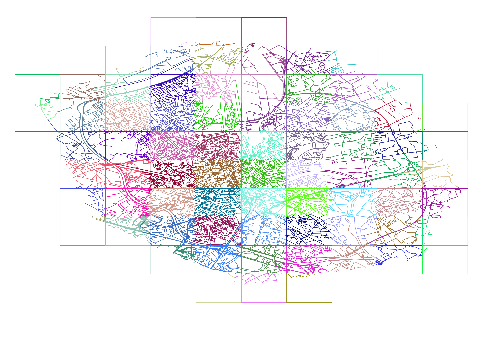
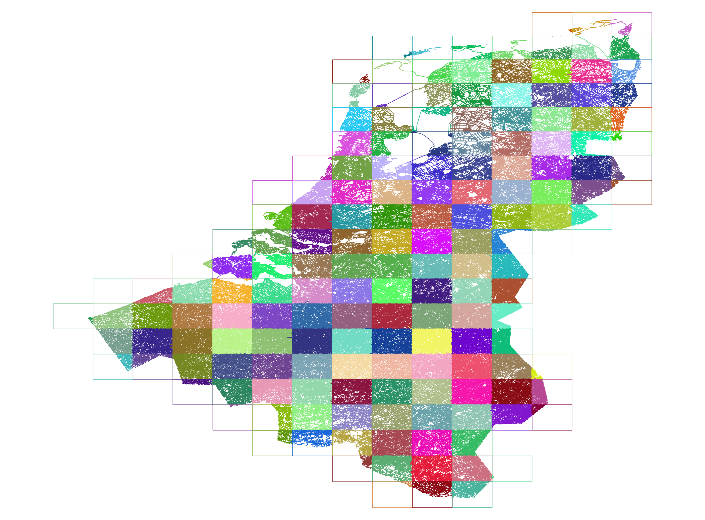

# routable-tiles

[/statusIcon)](https://build.anyways.eu/viewType.html?buildTypeId=anyways_Openplannerteam_RoutableTiles)
  
This tool provides the road network as 'routable tiles' that can be consumed by route planning engines such as [Planner.js](https://planner.js.org/).

It consists of two parts:

1. CLI tool to generate routable tiles from an OpenStreetMap extract
2. HTTP API to serve the tiles according to the [Routable Tiles](https://openplanner.team/specs/2018-11-routable-tiles.html) specification

This is an example for the city of Ghent:



Or the Benelux:



## Usage

### Preparing input data

Starting with an extract of OpenStreetMap data (in the `.osm.pbf` format, for example from [Geofabrik downloads](http://download.geofabrik.de/)), first filter out all non-routing data using [Osmosis](https://wiki.openstreetmap.org/wiki/Osmosis).

#### Method A (in a single step)

`osmosis --read-pbf brussels-latest.osm.pbf --lp --tf accept-ways highway=* route=* --tf accept-relations type=route,restriction --used-node --lp --write-pbf brussels-routing.osm.pbf`

#### Method B (in smaller steps)

On a planet scale, you can do this in three steps if the previous method fails:

1. Extract ways: `osmosis --read-pbf planet-latest.osm.pbf --lp --tf accept-ways highway=* route=* --lp --write-pbf planet-1-highways.osm.pbf`
2. Only keep used nodes: `osmosis --read-pbf planet-1-highways.osm.pbf --lp --used-node --lp --write-pbf planet-1-used-nodes.osm.pbf`
3. Only keep routing related relations: `osmosis --read-pbf planet-1-used-nodes.osm.pbf --tf accept-relations type=route,restriction --lp --write-pbf planet-routing.osm.pbf`

REMARK: this can probably be optimized by tuning osmosis or using another tool to extract the routing data.

### Generating tiles

The second step is to convert the prepared OpenStreetMap extract into a tiled database. This 'database' is just a collection of files on disk containing the OSM data per tile.

Using Docker, you can run the CLI as follows, with `/path/to/db` pointing to an empty directory where you want to store the tiles and `/path/to/extract.osm.pbf` pointing to the file prepared in the previous step:

```
docker run --rm -v /path/to/db:/var/app/db/ -v /path/to/extract.osm.pbf:/var/app/source/input.osm.pbf openplannerteam/routeable-tiles
```

### Serving tiles

Using Docker, start the container like this, with `/path/to/db` pointing to the database created in the previous step:

`docker run -d -v /path/to/db:/var/app/db/ -v /path/to/logs/:/var/app/logs/ -p 5000:5000 --name routeable-tiles-api openplannerteam/routeable-tiles-api`

The tiles should now be available at `http://localhost:5000/{z}/{x}/{y}`

## Compiling from source

If you wish to compile the Docker images from the Git repository yourself, run:

```
git submodule init
git submodule update
dotnet publish -c Release -r linux-x64
docker build -t openplannerteam/routeable-tiles src/RouteableTiles.CLI/
docker build -t openplannerteam/routeable-tiles-api src/RouteableTiles.API/
```
